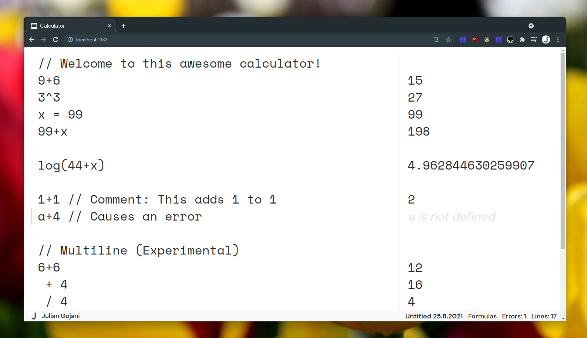
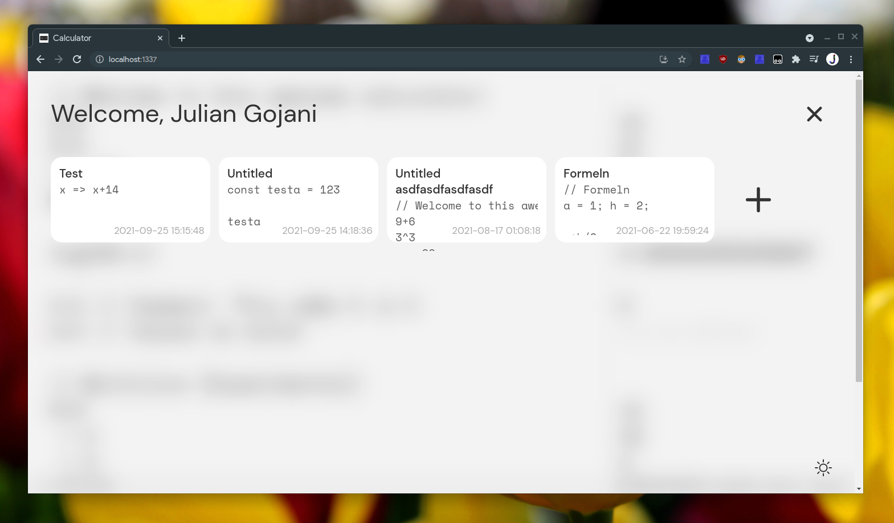
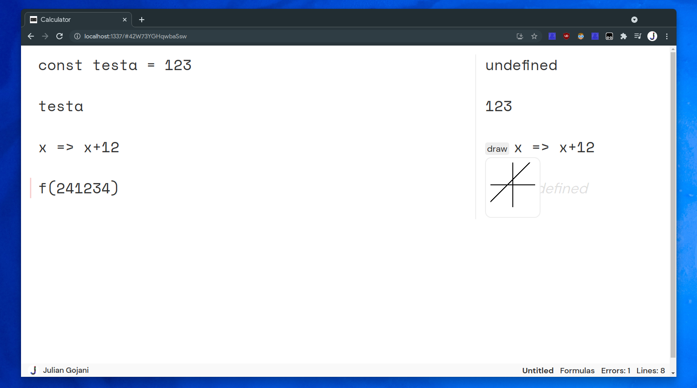
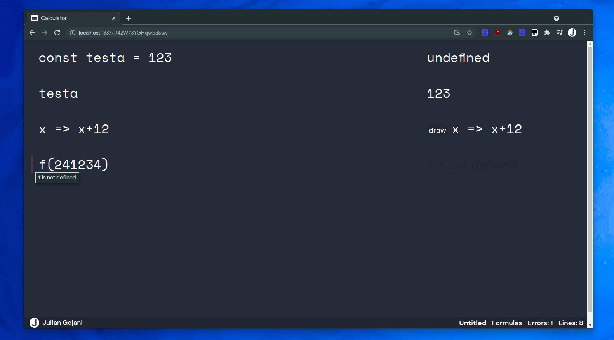

# Calculator
Calculator is a text-editor-like calculator with live calculation preview. Just enter your mathematical terms into the editor and you'll get a live preview.

Visit the calculator on [calc.gojani.xyz](https://calc.gojani.xyz) 

